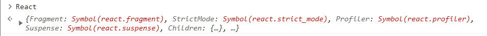
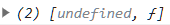

# movie-web

- [THE BASICS OF REACT](#the-basics-of-react)

  - [Before React](#before-react)
  - [Our First React Element](#our-first-react-element)
  - [Events in React](#events-in-react)
  - [JSX](#jsx)
  - [JSX part Two](#jsx-part-two)

- [STATE](#state)
  - [Understanding State](#understanding-state)
  - [setState part One](#setstate-part-one)
  - [setState part Two](#setstate-part-two)

## THE BASICS OF REACT

### Before React

- 기존의 바닐라 js

  ```javascript
  <!DOCTYPE html>
  <html>
      <body>
          <span>Total clicks: 0</span>
          <button id="btn">Click me</button>
      </body>
      <script>
          let counter = 0;
          const button = document.getElementById("btn");
          const span = document.querySelector("span");
          function handleClick() {
              counter = counter + 1;
              span.innerText = `Total clicks: ${counter}`;
          }
          button.addEventListener("click", handleClick)
      </script>
  </html>
  ```

  1. HTML을 만든다.

  ```javascript
  <body>
    <span>Total clicks: 0</span>
    <button id="btn">Click me</button>
  </body>
  ```

  2. `Javascript`에서 가져온다.

  ```javascript
  const button = document.getElementById("btn");
  const span = document.querySelector("span");
  ```

  3. `event`를 감지한다.

  ```javascript
  button.addEventListener("click", handleClick);
  ```

  4. 데이터를 업데이트한다.

  ```javascript
  counter = counter + 1;
  span.innerText = `Total clicks: ${counter}`;
  ```

  이런 식으로 계속 만든다면 많은 함수와 이벤트리스너를 만들게될 것이다.

  위에서 작성한 바닐라js는 `vanilla.html` 파일에 옮기고 새로 작성해보자.

  ***

  - 우선, React JS를 설치하기 위해서는 두 개의 Javascript 코드를 import 해야 한다.

    - `react`

      - `https://unpkg.com/react@17.0.2/umd/react.production.min.js`

    - `react-dom`
      - `https://unpkg.com/react-dom@17.0.2/umd/react-dom.production.min.js`

  `index.html`로 돌아왔을 때 아무것도 없지만 `console`에 `React`를 부를 수 있어야 한다.

  

  > 이렇게 뜬다면 `React`가 코드에 있다는 뜻이다.

### Our First React Element

- `React JS`: application을 interactive 하도록 만들어 주는 `library`

- `React-dom`: 모든 `react element`를 `HTML`의 `body`에 둘 수 있도록 해주는 `library` 혹은 `package`

  ***

- `React JS`로 `element`를 생성하는 어려운 방법

  > `React JS`가 어떤 방식으로 돌아가는지 하드코딩 해보는 것

  - `span` 만들기

  ```javascript
  const span = React.createElement("span", { id: "sexy-span", style: { color: "red" } }, "Hello I'm a span");
  ```

  여러 `argument`를 작성할 수 있다.

  > 굳이 기억할 필요는 없음

- `root` 만들기

  ```javascript
  const root = document.getElementById("root");
  ```

  - 보통 `body`에 `id="root"`를 만들어 `span`을 `root` 안에 두라고 함

- 바닐라js에서는 HTML을 먼저 만들고, 그걸 Javascript로 가져와서 HTML을 수정하는 과정이었음

- React JS에서는 Javascript로 시작해 HTML이 된다.

### Events in React

```javascript
const btn = React.createElement(
  "button", // HTML 생성
  {
    onClick: () => console.log("im clicked"), // event listener 등록
  },
  "Click me" // content
);
```

```javascript
  {
    onClick: () => console.log("im clicked"),
  },
```

`on` + `eventListener`를 해주어야 `React JS`는 이벤트리스터인 것을 이해할 수 있다.

### JSX

- `JSX`는 `JavaScript`를 확장한 문법으로, HTML에서 사용한 문법과 유사한 방식으로 `React` 요소를 만들 수 있게 해준다.

```JSX
const Title = (
      <h3 id="title" onMouseEnter={() => console.log("im clicked")}>
        Hello I'm a title
      </h3>
    );
```

```JSX
 const Button = (
      <button
        style={{
          backgroundColor: "tomato",
        }}
        onClick={() => console.log("im clicked")}
      >
        Click me
      </button>
    );
```

- `JSX` 작성 방식

  1. 태그를 적어준다.
  2. 안에 내용을 적어준다.
  3. `props`는 `HTML`과 똑같이 적어준다.
  4. 이벤트리스너는 태그의 속성처럼 추가해주면 된다.

- 브라우저는 `JSX`를 이해하지 못하므로 뭔가를 설치해줘야 한다.
  - `Babel`을 이용해 `JSX`로 적은 코드를 브라우저가 이해할 수 있는 형태로 바꿔줄 수 있다.
    `https://unpkg.com/@babel/standalone/babel.min.js`

### JSX part Two

```javascript
const container = React.createElement("div", null, [Title, Button]);
```

이 부분을 `JSX` 문법으로 바꿔보자.

```JSX
const Container = () => (
      <div>
        <Title />
        <Button />
      </div>
    );
```

> 주의할 점은 컴포넌트의 첫 글자(`Title`, `Button`)는 반드시 대문자여야 한다. 만약 소문자로 적는다면 `HTML` 태그라고 생각하기 때문이다.

- `container`를 `Container`로 바꾼 다음, `div` 안에 `Title`과 `Button`을 렌더링 해준다.

- 이때, `Title`과 `Button`을 함수로 선언해주어야 한다.

  - `() =>`와 같은 `arrow function`로 함수로 만든다.
  - ```JSX
    const Button = () => (

    )
    ```

- 컨테이너도 함수로 바꿔서 작성할 수 있다.

## STATE

### Understanding State

- `state`는 기본적으로 데이터가 저장되는 곳이다.

  - 바닐라 js에서 바뀌는 데이터인 `counter`를 `state`로 만들 수 있다.

- `React.js` 코드에서 카운트를 셀 수 있게 만들려고 한다.

  - 먼저 별로 좋지 않은 방식으로 만들어보자.

- 변수를 JSX에 전달하는 방법

  - `counter` 변수를 선언해주고, 그 변수를 중괄호 안에 넣어주면 된다.

    `let counter = 0;`

    ```JSX
    <h3>Total clicks: {counter}</h3>
    ```

- 이벤트리스너를 만들 필요 없이 `onClick prop`을 만들고 `counter`를 증가시키는 함수를 넣어주면 된다.

  ```jsx
  function countUp() {
    counter = counter + 1;
  }
  ```

  ```JSX
  <button onClick={countUp}>Click me</button>
  ```

- 버튼을 눌렀을 때, 분명 `counter`는 증가하고 있지만 UI가 업데이트되고 있지 않다.

  - 그 이유는 `Container`의 렌더링을 한 번만 해주고 있기 때문이다.

- 렌더링 함수를 만들고, `counter`의 값을 증가시킬 때마다 리렌더링 해주면 `Container`는 업데이트된 `counter`를 가지고 있을 것이다.

  ```jsx
  const root = document.getElementById("root");
  let counter = 0;
  function countUp() {
    counter = counter + 1;
    Render();
  }
  function Render() {
    ReactDOM.render(<Container />, root);
  }
  const Container = () => (
    <div>
      <h3>Total clicks: {counter}</h3>
      <button onClick={countUp}>Click me</button>
    </div>
  );
  Render();
  ```

<details>
<summary>바닐라 JS와 ReactJS의 노드 변경 처리 과정</summary>
<div markdown="1">
<p>
1. 바닐라 JS

DOM 변경을 직접 처리함. DOM 변경이 발생하면 브라우저는 변경된 DOM 트리를 다시 계산하고, 렌더 트리를 다시 생성한 후 화면에 그린다.

</p>

<p>
2. ReactJS

새로운 가상 DOM 트리를 생성하고, 이전의 가상 DOM 트리와 비교하여 변경된 부분만 파악함. 그리고 변경된 부분만 실제 DOM에 반영하는 방식을 사용함. 이 과정을 재조정(Reconciliation) 또는 Diffing 이라고 함

가상 돔을 사용함으로써, 변경이 필요한 최소한의 요소만 실제 DOM에 반영되기 때문에 불필요한 연산을 줄이고 성능을 향상시킬 수 있다.

</p>
</div>
</details>

### setState part One



- `React.useState()`는 `undefined`와 함수를 지닌 배열을 받는다.

- 이때, `undefined`는 `data`이고, `f`는 `data`를 바꿀 때 사용하는 함수이다.

  > `data`의 초기값을 설정해줄 수도 있다.

- 아래의 두 코드는 같은 역할을 한다.

  ```JSX
  const data = React.useState(0);
  ```

  ```JSX
  let counter = 0;
  function countUp() {
    // code
  }
  ```

- `counter`와 `modifier`를 자바스크립트의 구조 분해 할당 문법을 통해 할당해줄 수 있다.

  ```JSX
    const [counter, modifier] = React.useState(0);
  ```

<details>
<summary>구조 분해 할당</summary>
<div markdown="1">

<a href="https://developer.mozilla.org/ko/docs/Web/JavaScript/Reference/Operators/Destructuring_assignment">MDN - 구조 분해 할당</a>

</div>
</details>

### setState part Two

- `React.useState()`에서 `f`는 보통 `set + 데이터 이름`의 형태이다.

  - `const [counter, setCounter] = React.useState(0);`

- `setCounter` 함수는 받은 데이터 값으로 업데이트하고, 리렌더링을 한다.
  1. `counter` 데이터를 받음
  2. `return`문에 데이터를 담고 있음
     ```JSX
     return (
           <div>
             <h3>Total clicks: {counter}</h3>
             <button onClick={onClick}>Click me</button>
           </div>
         );
     ```
  3. 버튼을 클릭하면 클릭 이벤트리스너가 `onClick` 함수를 호출한다.
     ```JSX
     const onClick = () => {
           setCounter(counter + 1);
         };
     ```
  4. `setCounter` 함수는 counter 값을 업데이트하고 브라우저를 리렌더링 한다.
