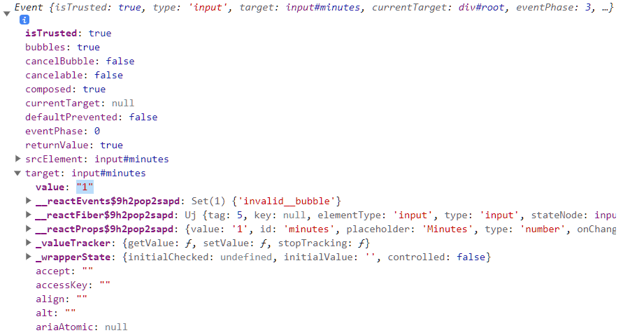
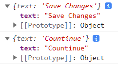
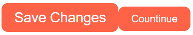
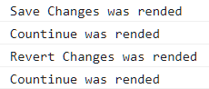
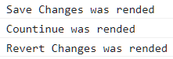
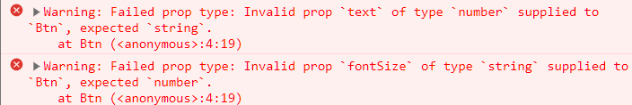

# movie-web

- [THE BASICS OF REACT](#the-basics-of-react)

  - [Before React](#before-react)
  - [Our First React Element](#our-first-react-element)
  - [Events in React](#events-in-react)
  - [JSX](#jsx)
  - [JSX part Two](#jsx-part-two)

- [STATE](#state)

  - [Understanding State](#understanding-state)
  - [setState part One](#setstate-part-one)
  - [setState part Two](#setstate-part-two)
  - [State Functions](#state-functions)
  - [Inputs and State](#inputs-and-state)
  - [State Practice part One](#state-practice-part-one)
  - [State Practice part Two](#state-practice-part-two)
  - [Final Practice and Recap](#final-practice-and-recap)

- [PROPS](#props)
  - [Props](#props-1)
  - [Memo](#memo)
  - [Prop Types](#prop-types)

## THE BASICS OF REACT

### Before React

- 기존의 바닐라 js

  ```javascript
  <!DOCTYPE html>
  <html>
      <body>
          <span>Total clicks: 0</span>
          <button id="btn">Click me</button>
      </body>
      <script>
          let counter = 0;
          const button = document.getElementById("btn");
          const span = document.querySelector("span");
          function handleClick() {
              counter = counter + 1;
              span.innerText = `Total clicks: ${counter}`;
          }
          button.addEventListener("click", handleClick)
      </script>
  </html>
  ```

  1. HTML을 만든다.

  ```javascript
  <body>
    <span>Total clicks: 0</span>
    <button id="btn">Click me</button>
  </body>
  ```

  2. `Javascript`에서 가져온다.

  ```javascript
  const button = document.getElementById("btn");
  const span = document.querySelector("span");
  ```

  3. `event`를 감지한다.

  ```javascript
  button.addEventListener("click", handleClick);
  ```

  4. 데이터를 업데이트한다.

  ```javascript
  counter = counter + 1;
  span.innerText = `Total clicks: ${counter}`;
  ```

  이런 식으로 계속 만든다면 많은 함수와 이벤트리스너를 만들게될 것이다.

  위에서 작성한 바닐라js는 `vanilla.html` 파일에 옮기고 새로 작성해보자.

  - 우선, React JS를 설치하기 위해서는 두 개의 Javascript 코드를 import 해야 한다.

    - `react`

      - `https://unpkg.com/react@17.0.2/umd/react.production.min.js`

    - `react-dom`
      - `https://unpkg.com/react-dom@17.0.2/umd/react-dom.production.min.js`

  `index.html`로 돌아왔을 때 아무것도 없지만 `console`에 `React`를 부를 수 있어야 한다.

  

  > 이렇게 뜬다면 `React`가 코드에 있다는 뜻이다.

### Our First React Element

- `React JS`: application을 interactive 하도록 만들어 주는 `library`

- `React-dom`: 모든 `react element`를 `HTML`의 `body`에 둘 수 있도록 해주는 `library` 혹은 `package`

  ***

- `React JS`로 `element`를 생성하는 어려운 방법

  > `React JS`가 어떤 방식으로 돌아가는지 하드코딩 해보는 것

  - `span` 만들기

  ```javascript
  const span = React.createElement(
    "span",
    { id: "sexy-span", style: { color: "red" } },
    "Hello I'm a span"
  );
  ```

  여러 `argument`를 작성할 수 있다.

  > 굳이 기억할 필요는 없음

- `root` 만들기

  ```javascript
  const root = document.getElementById("root");
  ```

  - 보통 `body`에 `id="root"`를 만들어 `span`을 `root` 안에 두라고 함

- 바닐라js에서는 HTML을 먼저 만들고, 그걸 Javascript로 가져와서 HTML을 수정하는 과정이었음

- React JS에서는 Javascript로 시작해 HTML이 된다.

### Events in React

```javascript
const btn = React.createElement(
  "button", // HTML 생성
  {
    onClick: () => console.log("im clicked"), // event listener 등록
  },
  "Click me" // content
);
```

```javascript
  {
    onClick: () => console.log("im clicked"),
  },
```

`on` + `eventListener`를 해주어야 `React JS`는 이벤트리스터인 것을 이해할 수 있다.

### JSX

- `JSX`는 `JavaScript`를 확장한 문법으로, HTML에서 사용한 문법과 유사한 방식으로 `React` 요소를 만들 수 있게 해준다.

```JSX
const Title = (
      <h3 id="title" onMouseEnter={() => console.log("im clicked")}>
        Hello I'm a title
      </h3>
    );
```

```JSX
 const Button = (
      <button
        style={{
          backgroundColor: "tomato",
        }}
        onClick={() => console.log("im clicked")}
      >
        Click me
      </button>
    );
```

- `JSX` 작성 방식

  1. 태그를 적어준다.
  2. 안에 내용을 적어준다.
  3. `props`는 `HTML`과 똑같이 적어준다.
  4. 이벤트리스너는 태그의 속성처럼 추가해주면 된다.

- 브라우저는 `JSX`를 이해하지 못하므로 뭔가를 설치해줘야 한다.
  - `Babel`을 이용해 `JSX`로 적은 코드를 브라우저가 이해할 수 있는 형태로 바꿔줄 수 있다.
    `https://unpkg.com/@babel/standalone/babel.min.js`

### JSX part Two

```javascript
const container = React.createElement("div", null, [Title, Button]);
```

이 부분을 `JSX` 문법으로 바꿔보자.

```JSX
const Container = () => (
      <div>
        <Title />
        <Button />
      </div>
    );
```

> 주의할 점은 컴포넌트의 첫 글자(`Title`, `Button`)는 반드시 대문자여야 한다. 만약 소문자로 적는다면 `HTML` 태그라고 생각하기 때문이다.

- `container`를 `Container`로 바꾼 다음, `div` 안에 `Title`과 `Button`을 렌더링 해준다.

- 이때, `Title`과 `Button`을 함수로 선언해주어야 한다.

  - `() =>`와 같은 `arrow function`로 함수로 만든다.
  - ```JSX
    const Button = () => (

    )
    ```

- 컨테이너도 함수로 바꿔서 작성할 수 있다.

<br>

## STATE

### Understanding State

- `state`는 기본적으로 데이터가 저장되는 곳이다.

  - 바닐라 js에서 바뀌는 데이터인 `counter`를 `state`로 만들 수 있다.

- `React.js` 코드에서 카운트를 셀 수 있게 만들려고 한다.

  - 먼저 별로 좋지 않은 방식으로 만들어보자.

- 변수를 JSX에 전달하는 방법

  - `counter` 변수를 선언해주고, 그 변수를 중괄호 안에 넣어주면 된다.

    `let counter = 0;`

    ```JSX
    <h3>Total clicks: {counter}</h3>
    ```

- 이벤트리스너를 만들 필요 없이 `onClick prop`을 만들고 `counter`를 증가시키는 함수를 넣어주면 된다.

  ```jsx
  function countUp() {
    counter = counter + 1;
  }
  ```

  ```JSX
  <button onClick={countUp}>Click me</button>
  ```

- 버튼을 눌렀을 때, 분명 `counter`는 증가하고 있지만 UI가 업데이트되고 있지 않다.

  - 그 이유는 `Container`의 렌더링을 한 번만 해주고 있기 때문이다.

- 렌더링 함수를 만들고, `counter`의 값을 증가시킬 때마다 리렌더링 해주면 `Container`는 업데이트된 `counter`를 가지고 있을 것이다.

  ```jsx
  const root = document.getElementById("root");
  let counter = 0;
  function countUp() {
    counter = counter + 1;
    Render();
  }
  function Render() {
    ReactDOM.render(<Container />, root);
  }
  const Container = () => (
    <div>
      <h3>Total clicks: {counter}</h3>
      <button onClick={countUp}>Click me</button>
    </div>
  );
  Render();
  ```

<details>
<summary>바닐라 JS와 ReactJS의 노드 변경 처리 과정</summary>
<div markdown="1">
<p>
1. 바닐라 JS

DOM 변경을 직접 처리함. DOM 변경이 발생하면 브라우저는 변경된 DOM 트리를 다시 계산하고, 렌더 트리를 다시 생성한 후 화면에 그린다.

</p>

<p>
2. ReactJS

새로운 가상 DOM 트리를 생성하고, 이전의 가상 DOM 트리와 비교하여 변경된 부분만 파악함. 그리고 변경된 부분만 실제 DOM에 반영하는 방식을 사용함. 이 과정을 재조정(Reconciliation) 또는 Diffing 이라고 함

가상 돔을 사용함으로써, 변경이 필요한 최소한의 요소만 실제 DOM에 반영되기 때문에 불필요한 연산을 줄이고 성능을 향상시킬 수 있다.

</p>
</div>
</details>

### setState part One


- `React.useState()`는 `undefined`와 함수를 지닌 배열을 받는다.

- 이때, `undefined`는 `data`이고, `f`는 `data`를 바꿀 때 사용하는 함수이다.

  > `data`의 초기값을 설정해줄 수도 있다.

- 아래의 두 코드는 같은 역할을 한다.

  ```JSX
  const data = React.useState(0);
  ```

  ```JSX
  let counter = 0;
  function countUp() {
    // code
  }
  ```

- `counter`와 `modifier`를 자바스크립트의 구조 분해 할당 문법을 통해 할당해줄 수 있다.

  ```JSX
    const [counter, modifier] = React.useState(0);
  ```

<details>
<summary>구조 분해 할당</summary>
<div markdown="1">

<a href="https://developer.mozilla.org/ko/docs/Web/JavaScript/Reference/Operators/Destructuring_assignment">MDN - 구조 분해 할당</a>

</div>
</details>

### setState part Two

- `React.useState()`에서 `f`는 보통 `set + 데이터 이름`의 형태이다.

  - `const [counter, setCounter] = React.useState(0);`

- `setCounter` 함수는 받은 데이터 값으로 업데이트하고, 리렌더링을 한다.
  1. `counter` 데이터를 받음
  2. `return`문에 데이터를 담고 있음
     ```JSX
     return (
           <div>
             <h3>Total clicks: {counter}</h3>
             <button onClick={onClick}>Click me</button>
           </div>
         );
     ```
  3. 버튼을 클릭하면 클릭 이벤트리스너가 `onClick` 함수를 호출한다.
     ```JSX
     const onClick = () => {
           setCounter(counter + 1);
         };
     ```
  4. `setCounter` 함수는 counter 값을 업데이트하고 브라우저를 리렌더링 한다.

### State Functions

- 흔하지는 않지만 `counter`가 다른 곳에서 변경될 수 있기 때문에 현재 `setState` 방법은 별로 좋지 않다.

- `state`를 바꾸는 두 가지 방법

  1. `setModifier`를 이용해 원하는 값을 넣어주기(새 값을 넣어주기)
  2. 이전 값을 이용해서 현재 값을 계산하기

     - 현재 사용하는 방법
       ```JSX
       setCounter(counter + 1);
       ```
     - 더 좋은 방법

       ```JSX
       setCounter((current) => current + 1);
       ```

- 둘 다 현재의 `state`를 가지고 새로운 값을 계산하지만, 아래쪽이 더 안전하다.

  - 함수를 사용하면 리액트가 `current`가 확실히 현재 값이라고 보장해주기 때문이다.
    <details>
    <summary>setState()</summary>
    <div markdown="1">
    <p>
    setState()는 컴포넌트를 항상 즉각적으로 갱신하지 않는다. 여러 변경 사항과 함께 일괄적으로 갱신하거나, 나중으로 미룰 수 있다.
    </p>

    <p>
    (state, props) => stateChange 와 같은 형태를 사용하면 갱신이 적용된 뒤에 실행되는 것이 보장된다.
    </p>

    <a href="https://ko.legacy.reactjs.org/docs/react-component.html#setstate">
    리액트 공식문서 - setState()</a>

    </div>
    </details>

### Inputs and State

- 단위 변환 앱을 만들어보자.

- `JSX` 문법은 `HTML`과 매우 유사한 형식으로 `form`을 작성할 수 있다.

  - 만약 `production.min.js`을 `import` 하면 `HTML`의 속성을 그대로 사용할 수 있다. 하지만, `development.js`를 `import` 한다면 다르게 써주어야 한다.

    > for ${\rightarrow}$ htmlFor
    > class ${\rightarrow}$ className

    <details>
    <summary>production과 development의 차이</summary>
    <div markdown="1">
    <p>
    production은 배포 모드, development는 개발 모드를 의미한다. 개발모드는 버그로 이어질 수 있는 요소들을 미리 경고하는 검증 코드가 포함되어 있다.
    </p>
    <p>
    production 모드로 사용하면 편집기 에러 메시지가 줄어들고, 코드가 줄어듬으로써 파일이 가벼워지고 따라서 배포하기 좋아진다.
    </p>
    참고: <a href="https://ui.toast.com/weekly-pick/ko_20191212">개발(Development) 모드는 어떻게 작동할까?</a>

    </div>
    </details>

    ```js
    <div>
      <h1>Super Converter</h1>
      <label for="minutes">Minutes</label>
      <input id="minutes" placeholder="Minutes" type="number" />
      <label for="hours">Hours</label>
      <input id="hours" placeholder="Hours" type="number" />
    </div>
    ```

- `ReactJS`에서는 `input`은 `uncontrolled`이다.

  - `input`의 `value`를 통제할 수 없기 때문에 `state`를 만들어줄 것이다.

- `const [minutes, setMinutes] = React.useState();`

  > `useState()`의 `default`는 비워도 되고, `""`로 해도 된다.

  - `useState()`는 `array`를 제공하는데, 첫 번째 `element`는 현재의 값이 되고, 두 번째 `element`는 데이터를 변경해주는 함수가 들어간다.

- 사용자가 다른 값을 입력할 때마다 `value`를 업데이트 시켜보자.
  

  > `console.log(event);`를 해보면 `target`에 `value`를 가지고 있다는 것이다. 즉, `event.target.value`를 해주면 `value`값에 접근할 수 있다.

  ```JSX
    const [minutes, setMinutes] = React.useState();
      const onChange = (event) => {
        setMinutes(event.target.value);   // React.useState()의 modifier 함수: event.target.value(사용자의 input value값)를 받아서 데이터(minutes)를 업데이트 하고 리렌더링 해준다.
      };
      return (
        <div>
          <h1>Super Converter</h1>
          <label for="minutes">Minutes</label>
          <input
            value={minutes}   // React.useState()의 데이터값(=사용자의 input값)
            id="minutes"
            placeholder="Minutes"
            type="number"
            onChange={onChange}   // onChange 이벤트리스너: input에 변화가 있을 때마다 onChange 함수를 호출한다.
          />
          <h4>You want to convert {minutes}</h4>    // input값이 변할 때마다 데이터 값이 업데이트 된다.
          <label for="hours">Hours</label>
          <input id="hours" placeholder="Hours" type="number" />
        </div>
      );
  ```

### State Practice part One

- 분을 시로 바꿔주는 변환기를 만들어보자.

  - ```JSX
    <div>
      <label for="hours">Hours</label>
      <input
        value={Math.round(minutes / 60)}
        id="hours"
        placeholder="Hours"
        type="number"
      />
    </div>
    ```
    - `Hours`의 `value`에도 `minutes` 값을 받으면 `Minutes`의 `value`값을 바꾸면 분과 시의 `value`가 동시에 바뀐다. 하지만, `Hours`에는 `onChange` 함수가 없기 때문에 `Hours`의 `value`는 바꿀 수 없다.
    - `mintes`에 60을 나눠주면 시가 되기 때문에 `Math.round()` 함수를 이용해 반올림 해준다.

- 리셋 버튼도 만들어보자.

  - `reset` 함수를 만들어주고

    ```JSX
      function App() {
        ...
        const reset = () => setMinutes(0);
        return (
          ...
        );
      }
    ```

  - 버튼에 `onClick` 이벤트리스너를 만들어주면 된다.
    ```JSX
    function App() {
      ...
      const reset = () => setMinutes(0);
      return (
        <div>
          ...
          <button onClick={reset}>Reset</button>
        </div>
      );
    }
    ```

### State Practice part Two

- 단위 변환을 뒤집는 `flip function`을 만들어보자.

  - 버튼을 누르면 `Hours`를 `enabled` 해주고, `Minutes`를 `disabled`하게 해준다.(다시 누르면 반대)

    ```JSX
    function App() {
      const [amount, setAmount] = React.useState();
      const [flipped, setFlipped] = React.useState(false);    // flipped의 초기값을 false로 지정
      const onChange = (event) => {
        setAmount(event.target.value);
      };
      const reset = () => setAmount(0);
      const onFlip = () => {
        reset();
        setFlipped((current) => !current);    // 현재 상태에서 부정명제를 붙이므로 flipped는 true 상태였다면 false로, false 상태였다면 true로 바뀌게 된다.
      };
      return (
        <div>
          <h1>Super Converter</h1>
          <div>
            <label for="minutes">Minutes</label>
            <input
              value={flipped ? amount * 60 : amount}
              {/*
              flipped가 true라면 disabled=true(==="분" 변경 불가, "시" 변경 가능)이므로 Minutes의 값은 amount*60(===입력한 값("시") * 60 === "분")
              flipped가 false(===disabled=false)(==="시" 변경 불가, "분" 변경 가능)라면 amount(===입력한 값("분") 그대로)
              */}
              id="minutes"
              placeholder="Minutes"
              type="number"
              onChange={onChange}
              disabled={flipped}    // flipped의 초기값은 false이므로 처음에는 변경이 가능함
            />
          </div>
          <div>
            <label for="hours">Hours</label>
            <input
              value={flipped ? amount : Math.round(amount / 60)}
              {/*
              flipped가 true라면 disabled=!ture=false(==="시" 변경 가능, "분" 변경 불가)이므로 Hours의 값은 amount(===입력한 값("시"))
              flipped가 false라면 disabled=!false=true)(==="분" 변경 가능, "시" 변경 불가)라면 Math.round(amount / 60)(===입력한 값("분" / 60))
              */}
              id="hours"
              placeholder="Hours"
              type="number"
              onChange={onChange}
              disabled={!flipped}   // flipped의 초기값은 false이고, 부정명제이니 disabled=true. 처음에는 변경이 불가능함
            />
          </div>
          <button onClick={reset}>Reset</button>
          <button onClick={onFlip}>Flip</button>
        </div>
      );
    }
    ```

### Final Practice and Recap

- 킬로미터-인치 변환기를 만들고, 사용자가 시-분 변환기와 킬로미터-인치 변환기를 선택할 수 있도록 만들어보자.

- 원래 작성했던 시-분 변환기 코드를 새로운 컴포넌트(함수)(`MinutesToHours`)에 옮기고 `App` 컴포넌트(함수)에 분할정복한다.

  ```JSX
  function MinutesToHours() {...}
  function App() {
    return (
      <div>
        <h1>Super Converter</h1>
        <MinutesToHours />
      </div>
    );
  }
  ```

  이렇게 하면 `App` 컴포넌트는 `div`, `h1`, `MinutesToHours`를 렌더링 해주게 된다. 즉, 기존에 하던 역할은 그대로 유지할 수 있다는 것이다.

- 새로 만들 킬로미터-인치 변환 컴포넌트를 만들고 `App` 컴포넌트에 분할정복 해주면

  ```JSX
  function MinutesToHours() {...}
  function App() {
    return (
      <div>
        <h1>Super Converter</h1>
        <MinutesToHours />
        <KmToMiles />
      </div>
    );
  }
  ```

  이런 식으로 할 수 있다. 하지만 이 경우에는 `MinutesToHours`와 `KmToMiles` 두 개를 렌더링 하고 있고 사용자가 선택하지 못한다.

- `App` 컴포넌트가 `state`를 가지게 한 다음 이 `state`를 이용해 어떤 변환기를 선택할 것인지 확인할 것이다.

- [Input and State](#inputs-and-state)에서 사용자의 `input`값을 `event.target.value`로 알아낸 것처럼 `option` 태그에 `value`값을 주게 되면 사용자가 선택한 옵션을 알아낼 수 있다.

  ```JSX
  function App() {
        const [index, setIndex] = React.useState("-1");
        const onSelect = (evnet) => {
          setIndex(event.target.value);
        };
        return (
          <div>
            <h1>Super Converter</h1>
            <select value={index} onChange={onSelect}>
              <option value="-1">Select your units</option>
              <option value="0">Minutes & Hours</option>
              <option value="1">Km & Miles</option>
            </select>
          </div>
        );
      }
  ```

- 삼항연산자를 이용해 `value` 값에 따라 어떤 컴포넌트를 렌더링할 것인지 결정할 수 있다.

  ```JSX
  function App() {
        const [index, setIndex] = React.useState("-1");
        const onSelect = (evnet) => {
          setIndex(event.target.value);
        };
        return (
          <div>
            <h1>Super Converter</h1>
            <select value={index} onChange={onSelect}>
              <option value="-1">Select your units</option>
              <option value="0">Minutes & Hours</option>
              <option value="1">Km & Miles</option>
            </select>
            <hr />
            {index === "-1" ? "Please select your units" : null}
            {index === "0" ? <MinutesToHours /> : null}
            {index === "1" ? <KmToMiles /> : null}
          </div>
        );
      }
  ```

<details>
<summary>최종 코드</summary>
<div markdown="1">

```js
<!DOCTYPE html>
<html>
  <body>
    <div id="root"></div>
  </body>
  <script src="https://unpkg.com/react@17.0.2/umd/react.production.min.js"></script>
  <script src="https://unpkg.com/react-dom@17.0.2/umd/react-dom.production.min.js"></script>
  <script src="https://unpkg.com/@babel/standalone/babel.min.js"></script>
  <script type="text/babel">
    function MinutesToHours() {
      const [amount, setAmount] = React.useState();
      const [inverted, setInverted] = React.useState(false);
      const onChange = (event) => {
        setAmount(event.target.value);
      };
      const reset = () => setAmount(0);
      const onInvert = () => {
        reset();
        setInverted((current) => !current);
      };
      return (
        <div>
          <div>
            <label for="minutes">Minutes</label>
            <input
              value={inverted ? amount * 60 : amount}
              id="minutes"
              placeholder="Minutes"
              type="number"
              onChange={onChange}
              disabled={inverted}
            />
          </div>
          <div>
            <label for="hours">Hours</label>
            <input
              value={inverted ? amount : Math.round(amount / 60)}
              id="hours"
              placeholder="Hours"
              type="number"
              onChange={onChange}
              disabled={!inverted}
            />
          </div>
          <button onClick={reset}>Reset</button>
          <button onClick={onInvert}>
            {inverted ? "Turn back" : "Invert"}
          </button>
        </div>
      );
    }

    function KmToMiles() {
      const [amount, setAmount] = React.useState();
      const [inverted, setInverted] = React.useState(false);
      const onChange = (event) => {
        setAmount(event.target.value);
      };
      const reset = () => setAmount(0);
      const onInvert = () => {
        reset();
        setInverted((current) => !current);
      };
      return (
        <div>
          <div>
            <label for="km">Km</label>
            <input
              value={inverted ? amount * 1.609 : amount}
              id="km"
              placeholder="KM"
              type="number"
              onChange={onChange}
              disabled={inverted}
            />
          </div>
          <div>
            <label for="miles">Miles</label>
            <input
              value={inverted ? amount : amount / 1.609}
              id="miles"
              placeholder="Miles"
              type="number"
              onChange={onChange}
              disabled={!inverted}
            />
          </div>
          <button onClick={reset}>Reset</button>
          <button onClick={onInvert}>
            {inverted ? "Turn back" : "Invert"}
          </button>
        </div>
      );
    }

    function App() {
      const [index, setIndex] = React.useState("-1");
      const onSelect = (evnet) => {
        setIndex(event.target.value);
      };
      return (
        <div>
          <h1>Super Converter</h1>
          <select value={index} onChange={onSelect}>
            <option value="-1">Select your units</option>
            <option value="0">Minutes & Hours</option>
            <option value="1">Km & Miles</option>
          </select>
          <hr />
          {index === "-1" ? "Please select your units" : null}
          {index === "0" ? <MinutesToHours /> : null}
          {index === "1" ? <KmToMiles /> : null}
        </div>
      );
    }
    const root = document.getElementById("root");
    ReactDOM.render(<App />, root);
  </script>
</html>
```

</div>
</details>

<details>
<summary>다른 분 작품</summary>
<div markdown="1">

<a href="https://helloleesul.github.io/reactjs-super-converter/">helloleesul.github.io</a>

</div>
</details>

<br>

## PROPS

### Props

- `Props`는 부모 컴포넌트로부터 자식 컴포넌트에 데이터를 보낼 수 있게 해주는 일종의 방식이다.

  - 위에서 부모 컴포넌트는 `App` 컴포넌트, 자식 컴포넌트는 `MinutesToHours`와 `KmToMiles`가 될 수 있다.

- `Props`를 이해하고 왜 필요한지를 보기 위해 `Props`로 해결이 가능하게 될 문제를 봐보자.

  - 어플리케이션을 만들 때 버튼들이 있다.
    - 이 버튼들은 똑같게 보이도록 만든다. 하지만 아직 컴포넌트의 재사용 방법을 모르기 때문에 버튼마다 컴포넌트를 만들 것이다.

- 저장 버튼을 만들어보자.

  ```JSX
  function SaveBtn() {
      return (
        <button
          style={{
            backgroundColor: "tomato",
            color: "white",
            padding: "10px 20px",
            border: 0,
            borderRadius: 10,
          }}
        >
          Save Changes
        </button>
      );
    }
  function App() {
      return (
        <div>
          <SaveBtn />
        </div>
      );
    }
  ```

  - 여기서 확인 버튼을 만드려고 할 때, 함수를 만들고 `SaveBtn` 컴포넌트의 `JSX` 부분을 복사 붙여넣기할 것이다.

    ```JSX
    function SaveBtn() {
        return (
          <button
            style={{
              backgroundColor: "tomato",
              color: "white",
              padding: "10px 20px",
              border: 0,
              borderRadius: 10,
            }}
          >
            Save Changes
          </button>
        );
      }
      function ConfirmBtn() {
        return (
          <button
            style={{
              backgroundColor: "tomato",
              color: "white",
              padding: "10px 20px",
              border: 0,
              borderRadius: 10,
            }}
          >
            Confirm
          </button>
        );
      }
      function App() {
        return (
          <div>
            <SaveBtn />
            <ConfirmBtn />
          </div>
        );
      }
    ```

    - 두 버튼의 생김새는 똑같겠지만 버튼이 늘어날 때마다 컴포넌트를 만들고 스타일을 복사 붙여넣기 하는 것은 매우 귀찮은 작업이다.

- 스타일을 복사 붙여넣기 하는 것 대신에 설정이 가능하고, 텍스트만 변경 가능한 컴포넌트를 만들어보자.

- `Btn` 컴포넌트를 만들고, 두 개의 `Btn` 컴포넌트를 분할정복 해주자.

  ```JSX
  function Btn() {
      return (
        <button
          style={{
            backgroundColor: "tomato",
            color: "white",
            padding: "10px 20px",
            border: 0,
            borderRadius: 10,
          }}
        >
          Save Changes
        </button>
      );
    }

    function App() {
      return (
        <div>
          <Btn />
          <Btn />
        </div>
      );
    }
  ```

- `Btn`의 `sytle`을 재사용 하고, 텍스트를 설정 및 변경하고자 한다.

  - `HTML`이나 `ReactJS`의 `input`, `button`, `img`, 등에서
    - ```jsx
      <input type="text" />   // type="text"
      <button onClick={onClick}></button>   // onClick={}
          // src=""
      ```
    - 이런 구문(syntax)을 사용한다.
    - 이 구문을 컴포넌트에 똑같이 적용해 데이터를 전달시킬 수 있다.

- 이름은 마음대로 지어도 된다.

  ```JSX
  function App() {
        return (
          <div>
            <Btn text="Save Changes" />
            <Btn text="Countinue" />
          </div>
        );
      }
  ```

- 이렇게 해도 달라지는건 없다. 왜냐하면 `Btn` 컴포넌트는 `text`를 쓰고 있지 않기 때문이다.

  - 모든 컴포넌트는 인자를 받는데, 이 인자를 `Props`라고 한다.
    > `Btn`으로부터 전달 받는 `propreties`

- 결국 `<Btn text="Save Changes" />`는 `Btn` 함수를 불러서 `text`라는 인자를 보내는 것과 같다.

  - `Btn({text:"save Changes"})`

- `Props`를 `console.log` 해보자.

  ```JSX
  function Btn(props){
    console.log(props);
    return (
      ...
    )
  }
  ```

  

  - `Props`는 `App` 컴포넌트에서 보낸 모든 것들을 갖는 오브젝트이다. 그리고, `text`라는 이름의 `key`를 가지고 있다.

- `Btn` 컴포넌트의 텍스트 부분을 `Props` 오브젝트의 `text`를 참조하는 것으로 바꾸면

  ```JSX
    function Btn(props) {
        return (
          <button
            ...
          >
            {props.text}
          </button>
        );
      }
  ```

  - 이름만 다른 모양이 같은 두 버튼을 생성할 수 있다.

- 여기서 `shortcut`이 존재하는데 `Props`는 오브젝트이기 때문에 중괄호를 열고 `text`로 받아주면 `{props.text}`와 같은 형태로 써줄 필요 없이 `{text}`만 써줄 수 있다.

  ```JSX
    function Btn({ text }) {
        return (
          <button
            ...
          >
            {text}
          </button>
        );
      }
  ```

  - 이런 식으로 여러 `Props`를 받을 수도 있다.

    ```jsx
    function Btn({ text, big }) {
      return (
        <button
          style={{
            ...
            fontSize: big ? 22 : 16,
          }}
        >
          {text}
        </button>
      );
    }

    function App() {
      return (
        <div>
          <Btn text="Save Changes" big={true} />
          <Btn text="Countinue" big={false} />
        </div>
      );
    }
    ```

    

### Memo

- `Btn`에 `onClick function`을 달아보자.

  - `Save Changes` 버튼에 단순히 `text`를 넘기는 `useState`와 `text` 값을 업데이트 하는 함수를 만들자.

    ```jsx
    function App() {
      const [value, setValue] = React.useState("Save Changes");
      const changeValue = () => setValue("Revert Changes");
      return (
        <div>
          <Btn text={value} onClick={changeValue} />
          <Btn text="Countinue" />
        </div>
      );
    }
    ```

  - 여기서 `changeValue` 함수에 구문의 이름을`onClick`으로 지었다고 해서 이벤트리스너가 아니라, `Btn`으로 들어가는 `Prop`이다.
  - 이벤트리스너를 만들기 위해서는 `HTML`의 `button` 안에 직접 이벤트리스너를 작성해주어야 한다.

    ```jsx
    function Btn({ text, onClick }) {
      return (
        <button
          onClick={onClick}
          style={{
            backgroundColor: "tomato",
            color: "white",
            padding: "10px 20px",
            border: 0,
            borderRadius: 10,
          }}
        >
          {text}
        </button>
      );
    }

    function App() {
      const [value, setValue] = React.useState("Save Changes");
      const changeValue = () => setValue("Revert Changes");
      return (
        <div>
          <Btn text={value} onClick={changeValue} />
          <Btn text="Countinue" />
        </div>
      );
    }
    ```

- `App` 컴포넌트에 두 개의 버튼 컴포넌트가 분할정복 되어 있는데, 하나는 클릭 이벤트가 발생하면 데이터가 변경되고 하나는 데이터가 변경되지 않는다. `Btn` 컴포넌트에 `console.log(text, "was rended")`로 언제 리렌더링 되는지 살펴보자.

  

  - 맨 처음 웹페이지가 로드될 때 둘 다 렌더링 되었다가, 클릭 이벤트가 발생해 데이터가 변경되었을 때 `Countinue` 버튼도 리렌더링 되는 것을 알 수 있다.
  - 두 번째 버튼 컴포넌트의 데이터가 변경되지 않았음에도 `ReactJS`의 규칙에 의해 `App` 컴포넌트(부모)의 `state`가 변경되어 리렌더링 되고 있다.
  - 하지만, `ReactJS`에게 이 컴포넌트가 리렌더링 되지 않도록 할 수 있다.

- 컴포넌트의 `Prop`이 변경되지 않는 한에서 리렌더링의 여부를 결정할 수 있다.

  ```jsx
  function Btn({ text, onClick }) {
    console.log(text, "was rended");
    return (
      <button
        onClick={onClick}
        style={{
          backgroundColor: "tomato",
          color: "white",
          padding: "10px 20px",
          border: 0,
          borderRadius: 10,
        }}
      >
        {text}
      </button>
    );
  }

  const MemorizedBtn = React.memo(Btn); // 이런 기능이 있음

  function App() {
    const [value, setValue] = React.useState("Save Changes");
    const changeValue = () => setValue("Revert Changes");
    return (
      <div>
        <MemorizedBtn text={value} onClick={changeValue} />
        <MemorizedBtn text="Countinue" />
      </div>
    );
  }
  ```

  

### Prop Types

- 컴포넌트가 많은 `Props`를 가지고 있을 때 문제가 발생할 수 있다.

- 예를 들어, 사용자가 버튼에 `prop`으로 `fontSize`를 전달한다고 해보자.

  ```jsx
  function Btn({ text, fontSize }) {
    return (
      <button
        style={{
          ...,
          fontSize,
        }}
      >
        {text}
      </button>
    );
  }

  function App() {
    return (
      <div>
        <Btn text="Save Changes" fontSize={18} />
        <Btn text={"Continue"} fontSize={14} />
      </div>
    );
  }
  ```

- 여기서 실수로 `text`에는 숫자를, `fontSize`에는 문자를 전달했다고 해보자.

  ```jsx
  function App() {
    return (
      <div>
        <Btn text="Save Changes" fontSize={18} />
        <Btn text={14} fontSize={"Continue"} />
      </div>
    );
  }
  ```

  - 코드 상에서는 에러가 아니다. 잘못된 구문이나, 규칙에 어긋난 문자가 없기 때문이다. 하지만 컴포넌트의 방식에서는 에러이다.

- 리액트는 우리가 `text`에 문자를 받고, `fontSize`에 숫자를 받고 싶은지 모른다.

  - 이를 해결하기 위해, 리액트 팀으로부터 나온 `PropTypes`라는 패키지가 존재한다.
  - `PropTypes`는 어떤 타입의 `prop`을 받고 있는지 체크해준다.

- `컴포넌트_이름.propTypes{}`를 적어주면 `prop`의 타입이 무엇이고, 어떤 모양이어야 하는지 설명해줄 수 있게 된다.

  ```jsx
  function Btn({ text, fontSize }) {
    return (
      ...
    );
  }
  Btn.propTypes = {
    text: PropTypes.string,
    fontSize: PropTypes.number,
  };
  function App() {
    return (
      ...
    );
  }
  ```

- 코드 자체는 유효하기 때문에 리액트는 ui로 어떤 에러도 보여주고 있지 않지만, 잠시 개발모드로 변경하고 콘솔을 확인하면 다음과 같은 오류를 확인할 수 있다.
  

- `optionalString: PropTypes.string`, `optionalBool: PropTypes.bool`등과 같은 옵션을 사용하면 말 그대로 옵션(필수가 아님)으로 달 수 있고,

- 만약 필수로 들어가게끔 만들고 싶다면 `requiredFunc: PropTypes.func.isRequired` 등의 `.isRequired`를 달아주면 된다.

- 예를 들어, `text`를 `required`로 설정하고 `fontSize`는 `required` 설정을 하지 않을 수 있다.

  ```jsx
  Btn.propTypes = {
    text: PropTypes.string.isRequired,
    fontSize: PropTypes.number,
  };
  ```

- 사용자가 원한다면 `default value`(기본값)을 설정할 수 있는데,

  - `Javascript`의 문법 덕분에 설정할 수 있다.

  ```jsx
  function Btn({ text, fontSize = 16 }) {
    return (
      ...
    );
  }
  Btn.propTypes = {
    text: PropTypes.string.isRequired,
    fontSize: PropTypes.number,
  };
  function App() {
    return (
      <div>
        <Btn text="Save Changes" fontSize={18} />
        <Btn text={"Continue"} />
      </div>
    );
  }
  ```

  - 두 번째 버튼에 `fontSize`가 정의되어 있지 않지만 기본값을 줄 수 있다.
