- [CREATE REACT APP](#create-react-app)

  - [Introduction](#introduction)
  - [Tour of CRA](#tour-of-cra)

- [EFFECTS](#efects)

  - [useEffect](#useeffect)
  - [Deps](#deps)
  - [Cleanup](#cleanup)

- [PRACTICE MOVIE APP](#practice-movie-app)
  - [To Do List part One](#to-do-list-part-one)
  - [To Do List part Two](#to-do-list-part-two)
  - [Coin Tracker](#coin-tracker)
  - [Movie App part One](#movie-app-part-one)
  - [Movie App part Two](#movie-app-part-two)
  - [React Router](#react-router)
  - [Parameters](#parameters)

## CREATE REACT APP

### Introduction

1. node.js 설치

   - [node.js.org](https://nodejs.org/ko)

     

   - cmd에 `node-v`, `npx`를 입력했을 때 정상적으로 나온다면 완료

     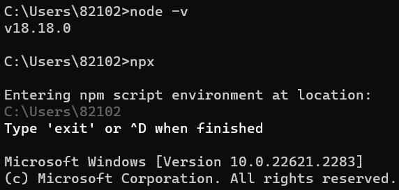

2. react-app 만들기

   - `npx create-react-app 폴더명`
   - 오류 발생 시
     1. npm 버전 업데이트
        `npm install -g npm@latest`
     2. npm 설정 초기화
        `npm config set registry https://registry.npmjs.org/`
     3. npm 캐시 삭제
        `npm cache clean --force`
     4. node.js 버전 확인
        `node -v`
     5. 프로젝트 디렉토리 생성
        `mkdir 디렉토리이름`
     6. 생성한 디렉토리로 이동
        `cd 디렉토리이름`
     7. react-app 생성
        `npx create-react-app .`
     8. `y` 입력

- `npm start` 를 입력하면 개발용 서버를 만들어준다.

- `src` 폴더는 모든 파일을 넣을 폴더인데 가장 중요한 파일은 `index.js`이다.

  - `create-react-app`은 어플리케이션을 가지고 `index.html` 안에 넣어주도록 설정되어 있다.

- `App.js`와 `index.js`만 남기고 나머지 파일들은 다 삭제해주자. 그리고 작성되어 있는 코드들은 간소화시키자.
  `App.js`

  ```jsx
  function App() {
    return (
      <div>
        <h1>Welcom back!</h1>
      </div>
    );
  }

  export default App;
  ```

  `index.js`

  ```jsx
  import React from "react";
  import ReactDOM from "react-dom";
  import App from "./App";

  ReactDOM.render(
    <React.StrictMode>
      <App />
    </React.StrictMode>,
    document.getElementById("root")
  );
  ```

- `vscode`에서 서버 여는 법
  - `npx`를 설치한 폴더로 들어간다.
    ```
    cd 폴더명
    ```
  - 서버를 구동시킨다.
    ```
    npm start
    ```
  - 자동으로 브라우저가 열리게 된다.

### Tour of CRA

- `src` 폴더에 `Button.js` 파일을 만들고 버튼을 만들어보자.

  ```jsx
  function Button({ text }) {
    return <button>{text}</button>;
  }

  export default Button;
  ```

- `App.js`에 `import` 하고 버튼 컴포넌트를 렌더링 해주자.

  ```jsx
  import Button from "./Button";

  function App() {
    return (
      <div>
        <h1>Welcom back!</h1>
        <Button text={"Continue"} />
      </div>
    );
  }

  export default App;
  ```

- `PropTypes`를 체크하고 싶으니 `prop-types`를 설치해보자.

  - 터미널에 위 명령어를 입력하면 된다.
    `npm i prop-types`

- `Button.js`

  ```jsx
  import PropTypes from "prop-types";

  function Button({ text }) {
    return <button>{text}</button>;
  }

  Button.propTypes = {
    text: PropTypes.string.isRequired,
  };

  export default Button;
  ```

- 익숙한 방식으로 작성할 수 있다.

  - 기존에 하던 코드와 똑같지만 다른 점은 서로 다른 파일들로 코드를 분할하는 등의 작업을 할 수 있게 된 것이다.
  - 또한, 특정 컴포넌트(여기서는 `Button`)를 위한 `css` 파일을 만들 수 있는 기능을 얻었다는 것이다.

- 먼저, `css`에 대한 두 가지 옵션이 있다.

  1.  `style.css`를 만들고 `import`해오는 것
      `style.css`

      ```css
      button {
        color: white;
        background-color: tomato;
      }
      ```

      `index.js`

      ```js
      import "./style.css";
      ...
      ```

      - `index.js`에 `style.css`를 `import` 한다면 `index.js`에 있는 모든 버튼은 배경이 빨간색인 버튼이 될 것이다.
      - 이때 다른 버튼을 만들고 이 버튼은 빨간색이 되지 않기를 원할 때, `index.js`에 `style.css`를 `import` 하지 않을 것이다.

  2.  `style prop`으로 `css` 변경하기
      `Button.js`
      ```jsx
      function Button({ text }) {
        return (
          <button
            style={{
              backgroundColor: "tomato",
              color: "white",
            }}
          >
            {text}
          </button>
        );
      }
      ```
      - 이 경우 `css` 파일이 없는 대신 `javascript`를 작성해야 한다.
      - 한 파일에 수많은 `css`가 한 파일에 존재할 것이다.

- 이를 동시에 해결하기 위한 `create-react-app`의 핵심은 `CSS module`이다.

- `Button.css`의 파일 이름을 `Button.module.css`로 바꾼 뒤, `btn`이라는 클래스를 만들어보자.
  `Button.moduel.css`

  ```jsx
  .btn {
  color: white;
  background-color: tomato;
  }

  ```

  - `Button.moduel.css`를 `index.js`에 `import` 하지 않고, `Button.js`에 `import 해줄 것이다.`
    `Button.js`

    ```jsx
    import styles from "./Button.module.css";

    function Button({ text }) {
      return <button className={styles.btn}>{text}</button>;
    }
    ```

- 결국 `Button.module.css`에 `css` 코드를 작성하고 있지만, `create-react-app`은 `css` 코드를 `javascript` 오브젝트로 변환시켜주고 있다.

- 예를 들어, `App`을 위한 `App.module.css`도 만들 수 있다.

  `App.module.css`

  ```css
  .title {
    font-family: system-ui, -apple-system, BlinkMacSystemFont, "Segoe UI", Roboto,
      Oxygen, Ubuntu, Cantarell, "Open Sans", "Helvetica Neue", sans-serif;
  }
  ```

  `App.js`

  ```js
  import styles from "./App.module.css";

  function App() {
    return (
      <div>
        <h1 className={styles.title}>Welcom back!</h1>
        <Button text={"Continue"} />
      </div>
    );
  }
  ```

## EFECTS

### useEffect

- `state`가 변화할 때 모든 컴포넌트는 다시 실행되고, 코드 또한 다시 실행된다.(리렌더링 된다.)

  - 하지만 api를 참조하는 것과 같이 첫 번째 렌더링에서만 실행되도록 하고 싶은 경우가 있다.

    ```jsx
    import { useState, useEffect } from "react";

    function App() {
      const [counter, setValue] = useState(0);
      const onClick = () => setValue((prev) => prev + 1);
      console.log("i run all the time");
      useEffect(() => {
        console.log("CALL THE API....");
      }, []);
      return (
        <div>
          <h1>{counter}</h1>
          <button onClick={onClick}>click me</button>
        </div>
      );
    }

    export default App;
    ```

    > `useEffect`는 두 개의 인자를 받는데, 첫 번째 인자는 한 번만 호출해줄 코드이고, 두 번째는 뒤에서 알아볼 것이다.

- 컴포넌트의 첫 번째 렌더링 시점에 `useEffect`는 함수를 호출해준다.

  - 코드 또한 렌더링 된다.

    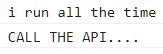

  - 여기서 `state`의 변화가 생기면 `useEffect`는 함수를 호출하지 않는다.

    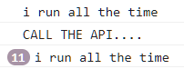

- 코드는 `state`가 변할 때마다 실행되는 반면, `useEffect` 안에 있는 함수는 한 번만 실행되었다.

- `useEffect`는 쉽게 말해서 코드가 한 번만 실행되도록 보호해준다.

### Deps

- `input`을 추가하고 안에 이벤트리스너로 사용자의 입력값을 받아보자.

  `App.js`

  ```jsx
  import { useState, useEffect } from "react";

  function App() {
    const [counter, setValue] = useState(0);
    const [keyword, setKeyword] = useState("");
    const onClick = () => setValue((prev) => prev + 1);
    const onChange = (event) => setKeyword(event.target.value);
    console.log("i run all the time");
    useEffect(() => {
      console.log("CALL THE API....");
    }, []);
    return (
      <div>
        <input
          value={keyword}
          onChange={onChange}
          type="text"
          placeholder="Search here..."
        ></input>
        <h1>{counter}</h1>
        <button onClick={onClick}>click me</button>
      </div>
    );
  }

  export default App;
  ```

  - 새로운 `useState`와 `onChange` 함수를 만들어 `input` 안에 이벤트리스너를 만들어 사용자가 입력한 값을 받을 수 있게 만들었다.

    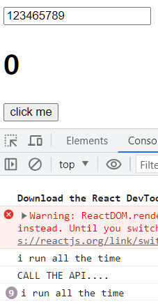

    - 하지만 값을 입력하거나 바꿀 때마다 `state`를 변경시켜 모든 컴포넌트를 리렌더링 하고 있다. 다행히 `useEffect`를 사용해 api를 매번 렌더링하는 것은 막고 있다.

- 이번에 하고 싶은 것은 검색이다.

  - 검색창에 무언가를 입력했을 때 입력 api를 사용한다고 해보자. 그렇지만 입력할 때마다 입력 api를 불러오고 싶지는 않다.

- 입력창에 `marvel`을 검색해보자.

  ```jsx
  import { useState, useEffect } from "react";

  function App() {
    ...
    console.log("i run all the time");
    useEffect(() => {
      console.log("CALL THE API....");
    }, []);
    console.log("SEARCH FOR", keyword);
    return (
      ...
    );
  }
  ```

  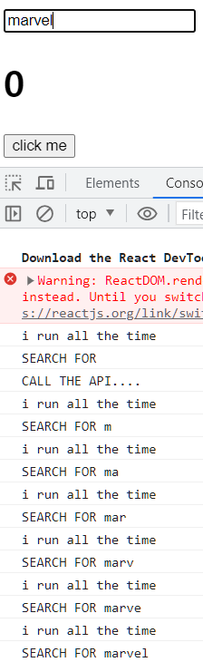

  - `marvel`을 찾았으니 목적은 달성했다. 하지만, 여기서 버튼을 계속 누르면 값을 계속 찾게 된다.

    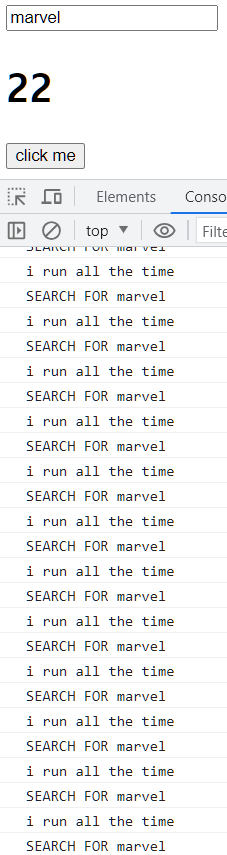

    - 검색 키워드에 변화가 있을 때만 검색을 하고 싶은 것이지, `counter`가 변화할 때에도 검색을 하고 싶은 것은 아니다.

- `useEffect` 함수를 하나 더 작성해보자.

  ```jsx
  useEffect(() => {
    console.log("SEARCH FOR", keyword);
  }, [keyword]);
  ```

  - 여기서 하는 것은 "`keyword`가 변화할 때만 코드를 실행해라" 라고 하는 것이다.

    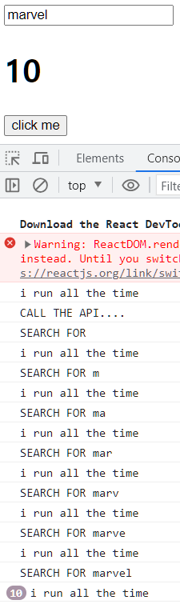

    - 더이상 검색은 하지 않는 것을 볼 수 있다.

- 아직 완벽하다고 할 수 없는데, 그 이유는 브라우저를 처음 시작할 때에도 검색이 되고 있기 때문이다.

  ```jsx
  useEffect(() => {
    if (keyword !== "" && keyword.length > 6) {
      console.log("SEARCH FOR", keyword);
    }
  }, [keyword]);
  ```

  - 위와 같은 조건을 달면 브라우저를 처음 시작할 때 검색이 되지 않는다.

  - `useEffect`의 두 번째 인자를 다르게 함으로써 특정 코드를 조건에 맞게 렌더링할 수 있다.

    ```jsx
    useEffect(() => {
      console.log("I run only once.");
    }, []);
    useEffect(() => {
      console.log("I run when 'keyword' changes");
    }, [keyword]);
    useEffect(() => {
      console.log("I run when 'counter' changes");
    }, [counter]);
    useEffect(() => {
      console.log("I run when 'keyword' & 'counter' changes");
    }, [keyword, counter]);
    ```

### Cleanup

- 그렇게 많이 쓰이는 것은 아니지만 `Cleanup function`을 배워보자.
  `App.js`

  ```jsx
  import { useState, useEffect } from "react";

  function Hello() {
    useEffect(() => {
      console.log("Im here!");
    }, []);
    return <h1>Hello</h1>;
  }

  function App() {
    const [showing, setShowing] = useState(false);
    const onClick = () => setShowing((prev) => !prev);
    return (
      <div>
        {showing ? <Hello /> : null}
        <button onClick={onClick}>{showing ? "Hide" : "Show"}</button>
      </div>
    );
  }

  export default App;
  ```

  - `Hello` 컴포넌트를 보여주고 숨기는 버튼을 만들었다.
  - 숨기면 `Hello` 컴포넌트는 없어지고(`destroy`), 보여주면 `Hello` 컴포넌트는 생성(`create`)된다.

- `ReactJS`의 기능 중 하나는 컴포넌트가 `destroy` 될 때에도 코드를 실행시킬 수 있다.

  - `useEffect`를 통해 컴포넌트를 `create` 했는데, `destroy` 또한 `useEffect`를 통해 할 수 있다.

    ```jsx
    function Hello() {
      useEffect(() => {
        console.log("created :)");
        return () => console.log("destroyed :(");
      }, []);
      return <h1>Hello</h1>;
    }
    ```

    <table>
    <tr>
    <th> Show </th>
    <th> Hide </th>
    </tr>
    <tr>
    <td>

    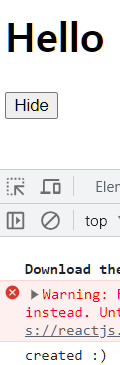

    </td>
    <td>

    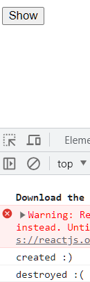

    </td>
    </tr>
    </table>

- 이 코드를 잘게 쪼개서 생각해보자.

  ```jsx
  function Hello() {
    function byFn() {
      console.log("bye :(");
    }
    function hiFn() {
      console.log("created :)");
      return byFn;
    }
    useEffect(hiFn, []);
    return <h1>Hello</h1>;
  }
  ```

  - `Hello` 컴포넌트가 생성될 때, `hiFn`이 실행되고 코드가 실행될 것이다.

  - `Hello` 컴포넌트가 언제 파괴되는지 알고 싶다면 `hiFn`이 `byFn`을 `return` 해주어야 한다.

- 총정리
  - `useEffect`는 인자로 `function`과 `dependency`를 받는다.
  - `fucntion`은 `dependency`가 변화될 때 호출된다.
  - 위의 경우에는 `dependency`가 비어있으므로, 컴포넌트가 처음 생성될 때 `function`이 호출된 후에 다시는 호출되지 않는다.
  - 컴포넌트가 파괴될 때도 `function`을 실행하고 싶다면, 호출된 `function`에서 파괴될 때 실행시킬 `fucntion`을 `return` 해주어야 한다.

<br />

## PRACTICE MOVIE APP

### To Do List part One

- to do list를 만들어보자.

  - `App.js`

    ```jsx
    import { useState } from "react";

    function App() {
      const [toDo, setToDo] = useState();
      const [toDos, setToDos] = useState([]);
      const onChange = (event) => setToDo(event.target.value);
      const onSubmit = (event) => {
        event.preventDefault();
        if (toDo === "") {
          return;
        }
        setToDo("");
      };
      return (
        <div>
          <h1>My To Dos</h1>
          <form onSubmit={onSubmit}>
            <input
              onChange={onChange}
              value={toDo}
              type="text"
              placeholder="Write your to do..."
            />
            <button>Add To Do</button>
          </form>
        </div>
      );
    }

    export default App;
    ```

    - 여기서 to do를 추가할 때, `toDos`의 `array`에 값을 넣고 싶다.

      - 바닐라 js에서는 `toDos.push()` 같은 방식으로 썼을 것이다.
      - 하지만, 리액트에서는 `state`의 값을 직접 수정할 수 없고, `state`를 변경하는 함수를 이용해야 한다.

- `array`를 직접 수정하지 않으면서 `element`를 추가하는 방법을 알아보자.

  - `setToDos`에 직전값을 받아올 것이다.

    - 첫 번째 방법은 `setToDo`처럼 직접 값을 수정하는 방법이고
    - 두 번째 방법은 함수를 넣는 것이다.

- 두 번째 방법을 이용해 첫 번째 인자로 현재의 `state`를 받고, 두 번째 인자로는 새로운 `array`를 받는 함수를 만들 것이다.

  - 새로운 `array`에는 `toDo`와 이전의 `toDos`를 갖게 될 것이다.

- 예시를 통해 어떻게 하는 지 알아보자.

  - `const number = [1, 2, 3, 4]` 이 `array`에 숫자 `5`를 추가하고 싶다.

    - `[number, 5]` 라고 입력한다면 의도하지 않은 결과가 나온다.

      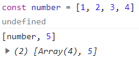

    - 대신 `array`에 `...`을 앞에 붙이면 `array`의 `element`를 `return` 해준다.

      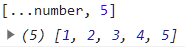

```jsx
function App() {
  ...
  const onSubmit = (event) => {
    event.preventDefault();
    if (toDo === "") {
      return;
    }
    setToDos((currentArray) => [toDo, ...currentArray]);
    setToDo("");
  };
  return(
    ...
  );
}
```

- 처음에는 비어있는 `array`로 시작한다.
- 첫 번째 todo를 입력할 때 현재 비어있는 `currentArray`를 받아온다.
- `setToDos`는 입력한 todo(첫 번재 todo)와 비어있는 `currentArray`의 `element`를 합친다.`currentArray=['첫 번째 todo']`
- 두 번째 todo를 입력할 때 `currentArray`에는 첫 번째 입력한 todo가 있다.
- `setToDos`는 입력한 todo(두 번째 todo)와 `currentArray`의 `element`를 합친다.`currentArray=['두 번째 todo', '첫 번재 todo']`

  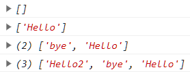

### To Do List part Two

- `array`로부터 동일한 컴포넌트에 있는 `element`들을 렌더링할 수 있는 방법을 알아볼 것이다.

- `array`의 `element`를 바꾸고 싶을 때가 있다.

  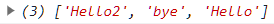

  - `map`은 하나의 `array`에 있는 `item`을 바꿔주고 새로운 `arary`를 `return`한다.

    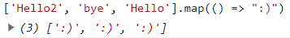

- `map`은 첫 번째 인자로 현재의 `item`을 가져올 수 있고, `return`하는 어떤 값이던지 새로운 `array`에 들어가게 된다. 즉, `item` 자체를 `return` 할 수도 있다는 말이다.

  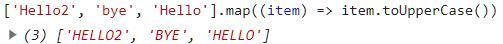

- `item` 자체를 리스트에 넣고 `return`해주면,

  ```jsx
  return (
    <div>
      ...
      <ul>
        {toDos.map((item) => (
          <li>{item}</li>
        ))}
      </ul>
    </div>
  );
  ```

  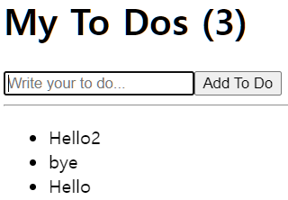

  - `array` 안의 `item`들이 리스트 형태로 바뀌게 된다.

- 여기서 `react`가 기본적으로 `list` 안에 있는 모든 `item`을 인식하기 때문에, 같은 컴포넌트의 `list`를 렌더링할 때 `key`라는 `prop`을 넣어주어야 한다.

  ```jsx
  return (
    <div>
      ...
      <hr />
      <ul>
        {toDos.map((item, index) => (
          <li key={index}>{item}</li>
        ))}
      </ul>
    </div>
  );
  ```

<details>
<summary>index를 넣는 이유</summary>
<div markdown="1">

<a href="https://ko.legacy.reactjs.org/docs/lists-and-keys.html#keys">reactjs 공식문서</a>

</div>
</details>

### Coin Tracker

- 암호화폐들과 그 가격을 나열하는 프로젝트를 만들어보자.

  - `https://api.coinpaprika.com/v1/tickers`

    - 위 api를 통해 가상화폐에 대한 정보를 얻을 수 있다.

      ```jsx
      useEffect(() => {
        fetch("https://api.coinpaprika.com/v1/tickers");
      }, []);
      ```

      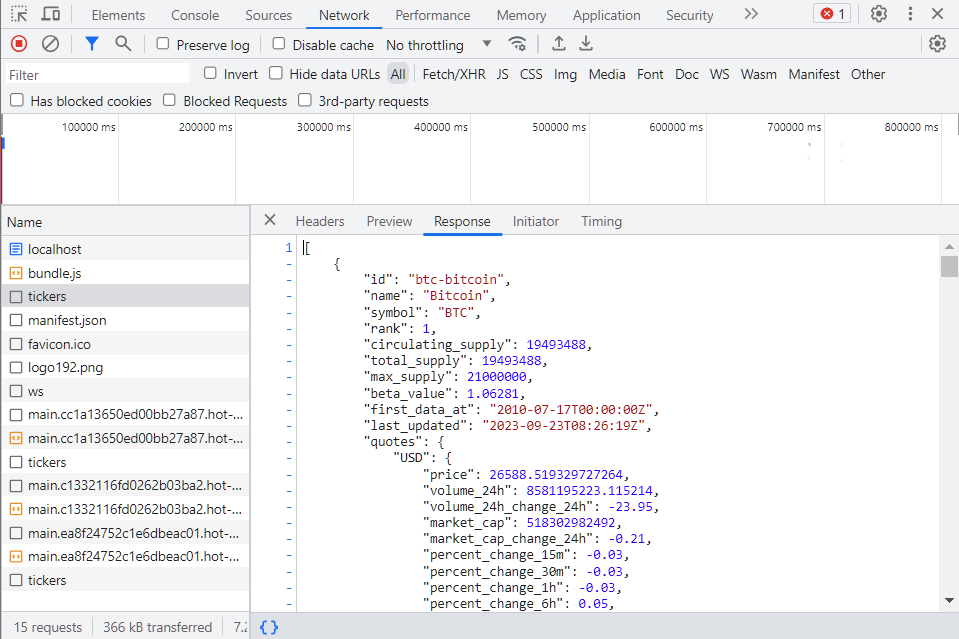

      - `response`로부터 `json`을 추출해보자.

- api 호출이 성공했을 경우, `response`를 받아서 `response.json`을 `return` 해주자.

  > `then`은 api 호출이 성공했을 경우 응답(`response`) 객체를 `resolve`하고
  > 실패했을 경우(`catch`)에는 예외(`error`)를 `reject`한다.

  ```jsx
  useEffect(() => {
    fetch("https://api.coinpaprika.com/v1/tickers")
      .then((response) => response.json())
      .then((json) => console.log(json));
  }, []);
  ```

  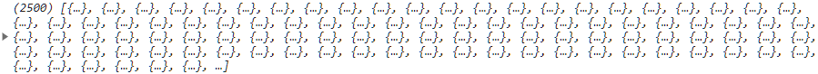

  - 2500개의 코인 데이터를 받았다.

- `json`에 데이터를 가지고 있고, 컴포넌트에 보여주기 위해서는 이 데이터를 `state`에 넣어주면 된다.

  ```jsx
  function App() {
    const [loading, setLoading] = useState(true);
    const [coins, setCoins] = useState([]);
    useEffect(() => {
      fetch("https://api.coinpaprika.com/v1/tickers")
        .then((response) => response.json())
        .then((json) => {
          setCoins(json);
          setLoading(false);
        });
    }, []);
    return (
      <div>
        <h1>The Coins!</h1>
        {loading ? <strong>Loading...</strong> : null}
      </div>
    );
  }
  ```

  - api 호출이 성공했을 경우 `coins`의 `state`를 `json`으로 변경해주고, 로딩을 끝내준다.

- `coins`라는 변수에 코인들의 `array`가 있다는 것을 알 수 있다.

  - `map`을 이용해 코인들을 리스트에 담아보자.

    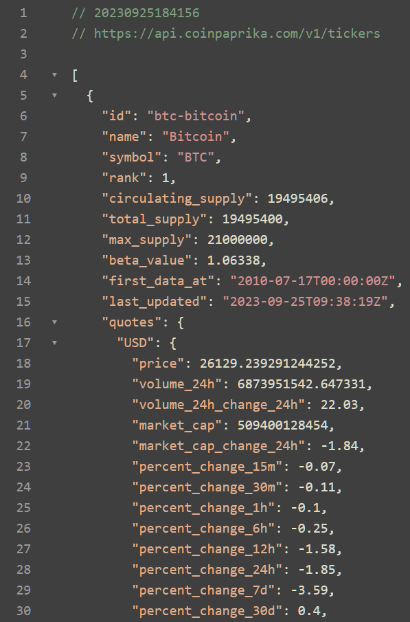

    - 많은 정보 중에 `name`, `symbol`, `quotes.USD.price`를 가져와보자.

      ```jsx
      function App() {
        ...
        return (
          <div>
            <h1>The Coins!</h1>
            {loading ? <strong>Loading...</strong> : null}
            <ul>
              {coins.map((coin) => (
                <li>
                  {coin.name} ({coin.symbol}): {coin.quotes.USD.price} USD
                </li>
              ))}
            </ul>
          </div>
        );
      }
      ```

- 리스트로 만들지 않고 `select`와 `option`을 이용해 원하는 코인을 선택해서 보여주거나, 달러를 입력했을 때 몇 개의 코인을 구입할 수 있는지 등으로 만들 수 있다.

### Movie App part One

- 영화의 정보를 보여주고 링크를 넣어 더 많은 정보를 볼 수 있게 다른 곳으로 연결하는 영화 소개 어플리케이션을 만들어보자.

  <details>
  <summary>영화 관련 api</summary>
  <div markdown="1">
  <a href="https://www.kobis.or.kr/kobisopenapi/homepg/apiservice/searchServiceInfo.do">영화진흥위원회 제공서비스</a>

  <a href="https://ji-gwang.tistory.com/54">영화 사이트 만들기</a>

  <a href="https://www.themoviedb.org/">The Movie DB</a>
  </div>
  </details>

- `yts.mx`에서 api를 통해 영화 리스트를 받아올 수 있다.
  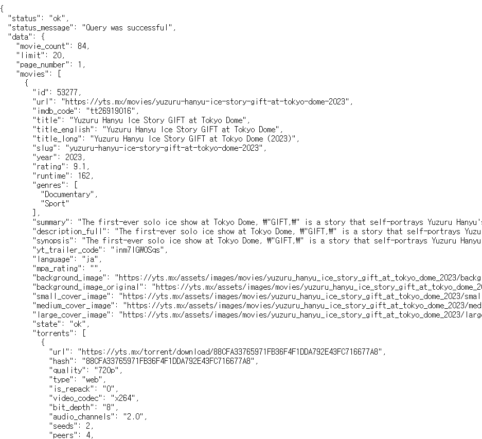

  - `state`를 만들어서 영화 리스트를 저장하고 로딩을 끝내자.

    ```jsx
    function App() {
      const [loading, setLoading] = useState(true);
      const [moveis, setMovies] = useState([]);
      useEffect(() => {
        fetch(
          `https://yts.mx/api/v2/list_movies.json?minimum_rating=8.8&sort_by=year`
        )
          .then((response) => response.json())
          .then((json) => {
            setMovies(json.boxOfficeResult);
            setLoading = false;
          });
      }, []);
      return <div>{loading ? <h1>Loading...</h1> : null}</div>;
    }
    ```

- 보통 `then`보다 `async-await`를 사용하는데 바꿔보자.

  ```jsx
  function App() {
    const [loading, setLoading] = useState(true);
    const [moveis, setMovies] = useState([]);
    const getMovies = async () => {
      const response = await fetch(
        `https://yts.mx/api/v2/list_movies.json?minimum_rating=8.8&sort_by=year`
      );
      const json = await response.json();
      setMovies(json.boxOfficeResult);
      setLoading(false);
    };
    useEffect(() => {
      getMovies();
    }, []);
    return <div>{loading ? <h1>Loading...</h1> : null}</div>;
  }
  ```

  - `async`와 `await`를 쓰는 것은 `then`과 같은 역할을 한다.

    - 코드를 더 간단하게 만들 수도 있다.

      ```jsx
      function App() {
        const [loading, setLoading] = useState(true);
        const [moveis, setMovies] = useState([]);
        const getMovies = async () => {
          const json = await (
            await fetch(
              `https://yts.mx/api/v2/list_movies.json?minimum_rating=8.8&sort_by=year`
            )
          ).json();
          setMovies(json.boxOfficeResult);
          setLoading(false);
        };
        useEffect(() => {
          getMovies();
        }, []);
        return <div>{loading ? <h1>Loading...</h1> : null}</div>;
      }
      ```

      > awiat 의 김밥같은 것이다.

- `title`, `summary`, `genre`, `image` 등을 가져올 수 있다.

  ```jsx
  return (
    <div>
      {loading ? (
        <h1>Loading...</h1>
      ) : (
        <div>
          {movies.map((movie) => (
            <div key={movie.id}>
              
              <h2>{movie.title}</h2>
              <p>{movie.summary}</p>
              <ul>
                {movie.genres && movie.genres.map((g) => <li key={g}>{g}</li>)}
              </ul>
            </div>
          ))}
        </div>
      )}
    </div>
  );
  ```

### Movie App part Two

- 한 페이지에서 다른 페이지로 넘어가는 방법을 배워보자.

- 우선 `Movie` 컴포넌트를 만들고 `App`에서 `import` 해오자.

  `Movie.js`

  ```jsx
  import PropTypes from "prop-types";

  function Movie({ coverImg, title, summary, genres }) {
    return (
      <div>
        
        <h2>{title}</h2>
        <p>{summary}</p>
        <ul>{genres && genres.map((g) => <li key={g}>{g}</li>)}</ul>
      </div>
    );
  }

  Movie.propTypes = {
    coverImg: PropTypes.string.isRequired,
    title: PropTypes.string.isRequired,
    summary: PropTypes.string.isRequired,
    genres: PropTypes.arrayOf(PropTypes.string).isRequired,
  };

  export default Movie;
  ```

  `App.js`

  ```jsx
  function App() {
    ...
    return (
      <div>
        {loading ? (
          <h1>Loading...</h1>
        ) : (
          <div>
            {movies.map((movie) => (
              <Movie
                key={movie.id}
                coverImg={movie.medium_cover_image}
                title={movie.title}
                summary={movie.summary}
                genres={movie.genres}
              />
            ))}
          </div>
        )}
      </div>
    );
  }
  ```

- `React Router`를 이용해 페이지를 전환해보자.

  - 터미널에 `npm install router-react-dom` 명령어로 `react-router`를 설치해준다.
    > 특정 버전 재설치 방법: `npm i react-router-dom@5.3.0`

- 이제 코드를 바꾸거나 이동을 시켜야 한다.

  - 그 이유는 `route` 별로 생각해야 하기 때문이다.

- `home route`에는 모든 영화를 보여주고, `movie route`에는 하나의 영화만 보여줄 것이다.

  - `src` 폴더에 `routes` 폴더를 만들고 `Home.js` 폴더를 만들자.
  - `Home.js`에 `App.js`에 있던 코드들을 전부 잘라넣는다.
  - 그리고 `routes` 폴더에 `Detail.js` 파일을 만든다.

    `Detail.js`

    ```jsx
    function Detail() {
      return <h1>Detail</h1>;
    }

    export default Detail;
    ```

- `App.js`는 더이상 영화들을 보여주지 않고 대신 `router`를 렌더링 한다. `router`는 `URL`을 보고 있는 컴포넌트이고 `URL`을 바꾸면 그에 따라 `Home`과 `Detail` 컴포넌트를 렌더링할 것이다.

### React Router

- `react-router-dom`을 사용하기 위해서는 몇 가지를 `import` 해주어야 한다.

  > `npm i react-router-dom@6.15` 명령어로 최신 버전 설치
  > `package.json`에서 바뀐 버전 확인(앞에 `^` 붙이기)

  `App.js`

  ```jsx
  import { BrowserRouter as Router, Route, Routes } from "react-router-dom";
  import Detail from "./routes/Detail";
  import Home from "./routes/Home";

  function App() {
    return (
      <Router>
        <Routes>
          <Route path="/" element={<Home />} />
          <Route path="movie" element={<Detail />} />
        </Routes>
      </Router>
    );
  }

  export default App;
  ```

- 유저가 영화 제목을 클릭하면 `Detail` `route`로 이동시키고 싶다.

  - `Movie`에서 링크를 만들어서 이동시키면 되긴 하지만 페이지 전체가 재실행 된다는 단점이 있다.

    `Movie.js`

    ```jsx
    function Movie({ coverImg, title, summary, genres }) {
      return (
        <div>
          
          <h2>
            <a href="/movie">{title}</a>
          </h2>
          <p>{summary}</p>
          <ul>{genres && genres.map((g) => <li key={g}>{g}</li>)}</ul>
        </div>
      );
    }
    ```

- 대신에 `Link to`를 사용하자.

  `Movie.js`

  ```jsx
  import { Link } from "react-router-dom";

  function Movie({ coverImg, title, summary, genres }) {
    return (
      <div>
        
        <h2>
          <Link to="/movie">{title}</Link>
        </h2>
        <p>{summary}</p>
        <ul>{genres && genres.map((g) => <li key={g}>{g}</li>)}</ul>
      </div>
    );
  }
  ```

  - 링크를 클릭하면 페이지가 새로고침되지 않고 다른 `route`로 이동할 수 있다.

### Parameters
